# Every Alarm : Don't Late! 

<div align="center">

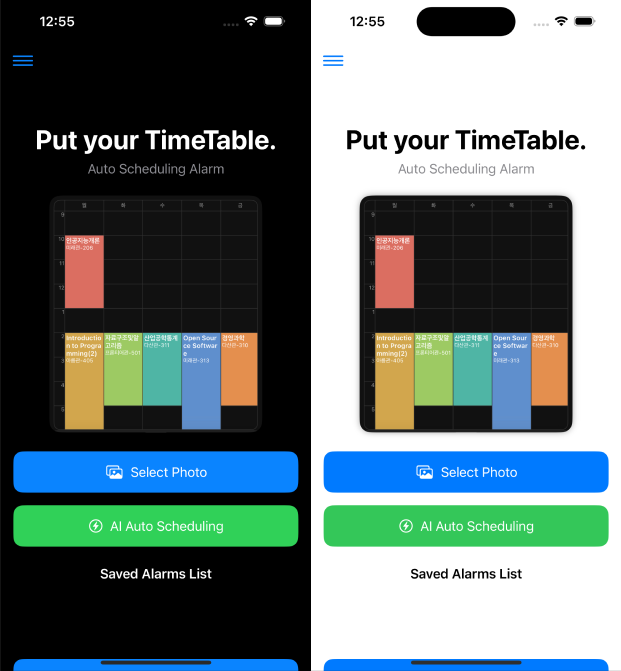

**에브리타임 시간표를 자동으로 인식하여 알람을 설정하는 iOS 앱**

[](https://www.python.org/)
[](https://github.com/ultralytics/ultralytics)
[](https://swift.org/)
[](LICENSE)


</div>

---

## 📋 목차

- [프로젝트 소개](#-프로젝트-소개)
- [주요 기능](#-주요-기능)
- [기술 스택](#-기술-스택)
- [시스템 아키텍처](#-시스템-아키텍처)
- [설치 및 실행](#-설치-및-실행)
- [사용 방법](#-사용-방법)
- [프로젝트 구조](#-프로젝트-구조)
- [데모 영상](#-데모-영상)
- [게임화 알람 시스템 상세](#-게임화-알람-시스템-상세)
- [핵심 기술 상세](#-핵심-기술-상세)
- [데이터베이스 구조](#-데이터베이스-구조)
- [한계점 및 향후 계획](#-한계점-및-향후-계획)
- [기여](#-기여)
- [라이선스](#-라이선스)

---

## 🎯 프로젝트 소개

**Every Alarm**은 대학생들이 필수적으로 사용하는 **에브리타임(Everytime)** 앱의 시간표 스크린샷을 자동으로 분석하여, 수업 시작 시간에 맞춰 알람을 설정해주는 iOS 애플리케이션입니다.

### 🔍 핵심 아이디어

- **문제**: 매 학기 시간표가 바뀔 때마다 수동으로 알람을 설정하는 번거로움
- **해결**: YOLOv11 객체 인식 모델을 활용한 시간표 자동 분석 및 알람 설정
- **가치**: 시간표 이미지 업로드만으로 자동화된 알람 시스템 구축

### 🛠 기술적 특징

1. **합성 데이터 생성**: PIL 라이브러리를 활용한 시간표 이미지 자동 생성
2. **YOLOv11n 모델**: 모바일 환경에 최적화된 경량 객체 인식 모델
3. **다크모드 지원**: 화이트/다크 모드 모두 인식 가능
4. **CoreML 변환**: iOS에서 실시간 추론 가능한 모델 포맷

---

## ✨ 주요 기능

### AI 시간표 분석
- ✅ **시간표 이미지 자동 인식**: 에브리타임 시간표 스크린샷에서 수업 시간 추출
- ✅ **합성 데이터 생성**: 다양한 시간표 패턴의 학습 데이터 자동 생성
- ✅ **YOLOv11 학습**: 커스텀 시간표 데이터셋으로 모델 학습
- ✅ **다크모드 대응**: 화이트/다크 테마 모두 인식
- ✅ **iOS 앱 연동**: CoreML 모델로 변환하여 iOS 앱에 통합

### 게임화 알람 시스템
- 🎮 **4가지 미니게임**: 알람을 끄려면 게임을 완료해야 하는 강제 깨우기 시스템
  - **빠르게 버튼 누르기**: 5초 내에 15번 클릭
  - **자동차 피하기**: 떨어지는 장애물 7번 연속 회피
  - **색 구분 게임**: 색상 이름과 색상 일치 여부 판단 (5문제)
  - **산수 게임**: 간단한 덧셈/뺄셈/곱셈 문제 풀이 (5문제)
- 🎯 **게임 선택**: 알람마다 원하는 게임 선택 가능

---

## 🔧 기술 스택

### AI/ML
- **Python 3.8+**
- **YOLOv11n** (Ultralytics)
- **PyTorch**
- **OpenCV**
- **PIL (Pillow)**
- **NumPy**

### iOS
- **Swift 5+**
- **SwiftUI**
- **CoreML**
- **Xcode 14+**
- **GRDB.swift** (SQLite ORM)
- **UserNotifications** (알람 시스템)

### 데이터
- **YOLO 포맷** 라벨링
- **합성 데이터 생성** (PIL 기반)

---

## 🏗️ 시스템 아키텍처

### 전체 시스템 구조

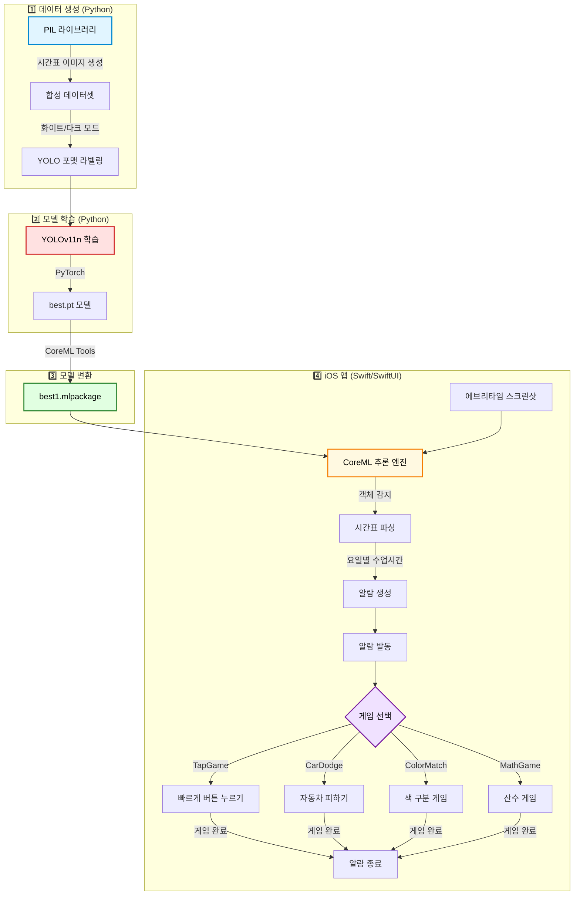

**설명:**
1. **Python 단계**: PIL로 합성 시간표 이미지를 생성하고 YOLO 포맷으로 라벨링
2. **모델 학습**: YOLOv11n을 PyTorch로 학습하여 `.pt` 가중치 생성
3. **iOS 배포**: CoreML Tools로 변환하여 iOS에서 실행 가능한 `.mlpackage` 생성
4. **앱 실행**: 사용자가 업로드한 시간표를 CoreML로 분석 → 알람 생성 → 게임 완료 후 알람 종료

### 데이터 파이프라인

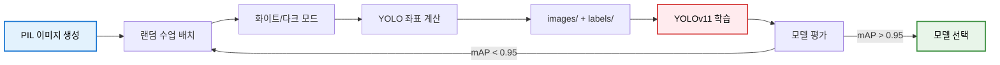

**설명:**
- **자동 라벨링**: PIL로 이미지 생성 시 YOLO 좌표를 자동 계산하여 수작업 라벨링 불필요
- **화이트/다크 모드**: 양쪽 테마에서 모두 작동하도록 학습 데이터 다양화

### iOS 앱 워크플로우

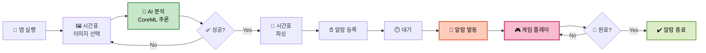

**설명:**
- **이미지 → AI 분석**: 에브리타임 스크린샷을 CoreML 모델로 객체 감지
- **시간표 파싱**: 요일별 첫 수업 시간을 추출하여 알람 자동 생성
- **게임 강제**: 알람 발동 시 선택한 게임을 완료해야만 종료 가능
- **에러 처리**: 분석 실패 시 이미지 재선택

### CoreML 추론 프로세스

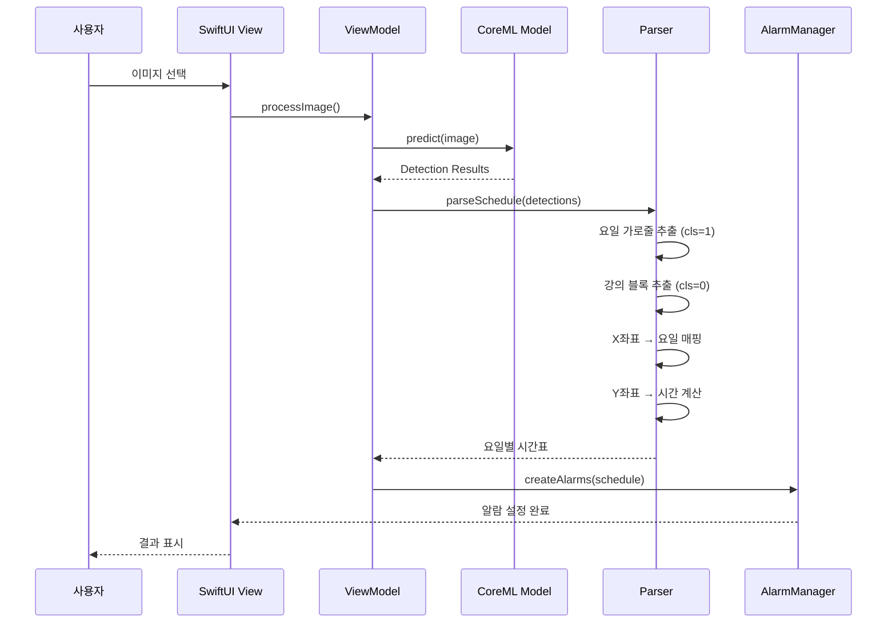

**설명:**
- **시퀀스 다이어그램**: SwiftUI View → ViewModel → CoreML → Parser → AlarmManager 간의 데이터 흐름
- **파싱 알고리즘**:
  1. 요일 가로줄(cls=1) 감지로 기준선 설정
  2. 강의 블록(cls=0) 감지 및 위치 분석
  3. X좌표로 요일 판별 (월~금 5개 열)
  4. Y좌표로 시간 계산 (9시~18시)
- **알람 생성**: 요일별 가장 빠른 수업 시간을 추출하여 AlarmManager에 전달

### 게임 시스템 플로우

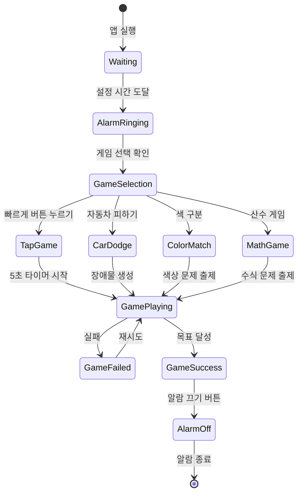

**설명:**
- **상태 기반 설계**: 알람 대기 → 울림 → 게임 선택 → 플레이 → 성공/실패 → 종료
- **4가지 게임 분기**: UserDefaults에 저장된 선택 게임에 따라 다른 게임 화면 표시
- **재시도 메커니즘**: 게임 실패 시 자동으로 재시작 (알람은 계속 울림)
- **강제 깨우기**: 게임 목표를 달성해야만 "알람 끄기" 버튼이 활성화되어 확실한 기상 유도

---

## 🚀 설치 및 실행

### 사전 요구사항

```bash
Python 3.8 이상
pip 패키지 관리자
```

### 1. 저장소 클론

```bash
git clone https://github.com/Jaehyeon-kr/Every_Alarm.git
cd Personalize_Alarm
```

### 2. 필수 패키지 설치

```bash
pip install ultralytics opencv-python pillow numpy torch
```

### 3. 폰트 설정 (Windows)

프로젝트는 한글 폰트(`malgun.ttf`)를 사용합니다. Windows 환경에서는 기본 경로가 설정되어 있으나, Mac/Linux는 폰트 경로를 수정해야 합니다.

```python
# schedule_img_aug.py 183-185번째 줄
FONT_TIME = ImageFont.truetype("/path/to/your/font.ttf", 40)
```

---

## 📖 사용 방법

### Step 1: 학습 데이터 생성

합성 시간표 이미지를 생성합니다. 인자로 생성할 이미지 개수를 지정합니다.

```bash
python scripts/schedule_img_aug.py 10000
```

**출력 결과:**
- `dataset/train/images/` - 생성된 시간표 이미지
- `dataset/train/labels/` - YOLO 포맷 라벨 파일

**파라미터:**
- `10000`: 생성할 이미지 개수 (권장: 5000~10000장)
  
<div align="center">
  
</div>


> ⚠️ **주의**: 이미지 개수가 많을수록 성능이 향상되지만, 저장 공간을 고려하세요.

### Step 2: YOLOv11 모델 학습

생성된 데이터로 YOLOv11n 모델을 학습합니다.

```bash
python scripts/yolo_train.py
```

**학습 파라미터:**
- `epochs`: 5 (기본값)
- `imgsz`: 640
- `batch`: 8
- `optimizer`: AdamW
- `lr0`: 1e-3

**학습 결과:**
- `runs/detect/trainX/weights/best.pt` - 최적 가중치
- `runs/detect/trainX/results.png` - 학습 그래프
- `runs/detect/trainX/confusion_matrix.png` - 혼동 행렬

### Step 3: 모델 추론 테스트

학습된 모델로 시간표 이미지를 추론합니다.

```bash
python scripts/true_inference.py --weights ./checkpoints/best.pt --img_path white_test.jpg
```

**출력 결과:**
```
요일별 첫 수업 시작
월요일 : 9시
화요일 : 10시
수요일 : 수업 없음
목요일 : 11시
금요일 : 9시

시각화 완료 → result_visualized.jpg 로 저장됨
```
<div align="center">
  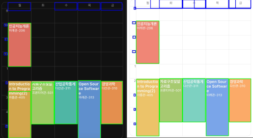
</div>

### Step 4: CoreML 모델 추출 (iOS 배포)

iOS 앱에서 사용하기 위해 PyTorch 모델을 CoreML 포맷으로 변환합니다.

```bash
# Mac 환경
python scripts/extract_model_for_Swift.py

# Windows 환경 - Google Colab 사용
# Colab에 코드 업로드 후 실행
```

**출력 결과:**
- `best1.mlpackage` - iOS에서 사용 가능한 CoreML 모델

### Step 5: iOS 앱 실행

iOS 앱을 실행하여 시간표 분석 및 알람 설정 기능을 사용합니다.

#### 사전 요구사항
- **Xcode 14 이상**
- **iOS 15.0 이상** (시뮬레이터 또는 실제 기기)
- **CoreML 모델 파일** (`best1.mlpackage` 등)

#### 실행 방법

1. **Xcode에서 프로젝트 열기**
```bash
cd PS_AR
open PS_AR.xcodeproj
```

2. **CoreML 모델 추가 확인**
   - 프로젝트 네비게이터에서 `best1.mlpackage` 파일이 포함되어 있는지 확인
   - 없다면 Step 4에서 생성한 모델 파일을 드래그 앤 드롭으로 추가

3. **시뮬레이터 또는 기기 선택**
   - Xcode 상단에서 타겟 디바이스 선택 (예: iPhone 15 Pro)

4. **빌드 및 실행**
   - `Cmd + R` 또는 상단의 ▶️ 버튼 클릭

#### 앱 사용 방법

전체 과정

<div align="center">
  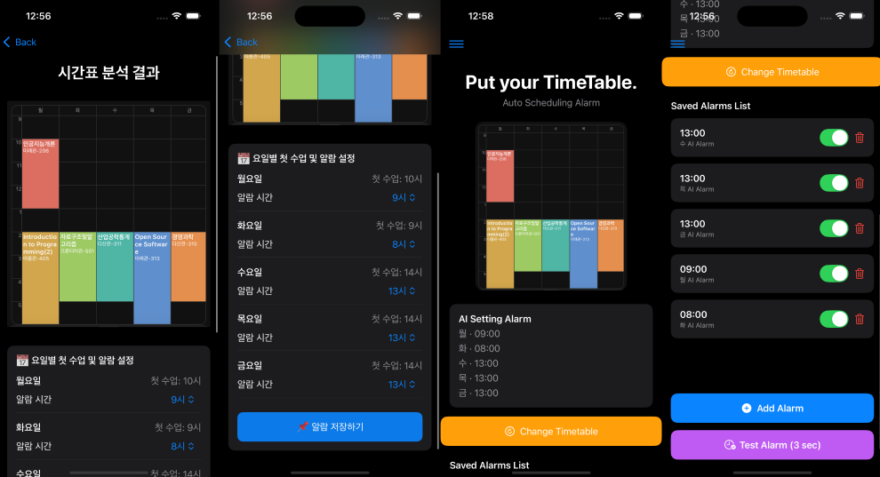
</div>


1. **시간표 이미지 선택**
   - 앱 실행 후 "Choose Image" 버튼을 눌러 갤러리에서 에브리타임 시간표 스크린샷 선택

<div align="center">
  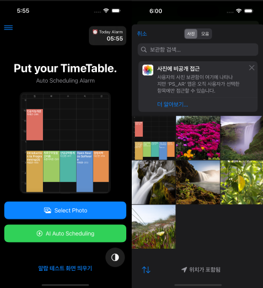
</div>

2. **AI 자동 분석**
   - "AI Auto Scheduling" 버튼 클릭
   - CoreML 모델이 시간표를 자동으로 분석하여 요일별 수업 시작 시간 추출

<div align="center">
  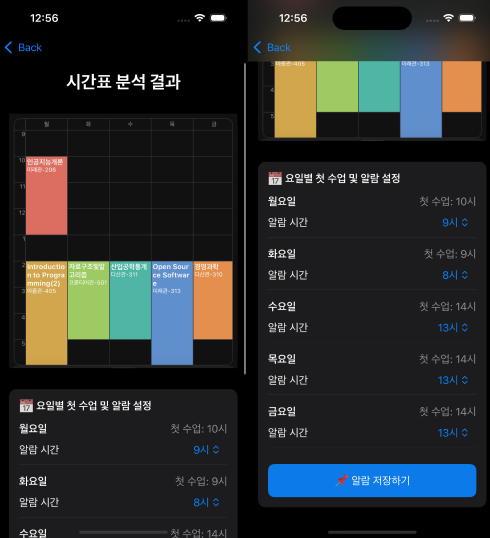
</div>

3. **알람 설정**
   - 분석 결과를 확인하고 원하는 요일의 알람 활성화
   - 알람 시간은 수업 시작 시간 기준으로 자동 설정됨

<div align="center">
  
</div>

4. **게임 선택 (선택사항)**
   - 설정 화면에서 알람용 게임 선택
   - 알람이 울리면 선택한 게임을 완료해야 알람이 꺼짐

<div align="center">
  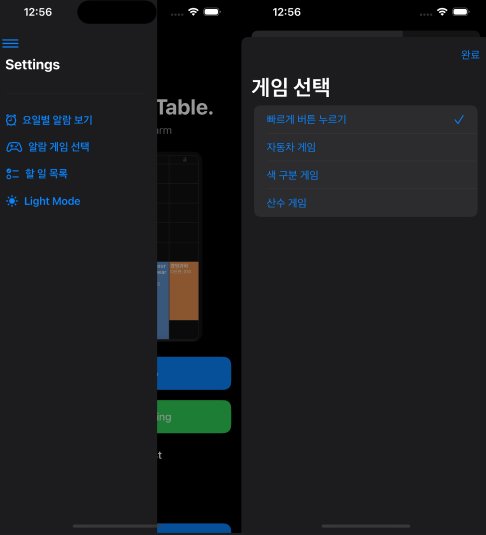
</div>

#### iOS 앱 주요 파일
```
PS_AR/
├── PS_AR.xcodeproj              # Xcode 프로젝트 파일
└── PS_AR/
    ├── ContentView.swift        # 메인 UI
    ├── HomeView.swift           # 홈 화면 (시간표 분석)
    ├── AlarmListView.swift      # 알람 목록
    ├── GameSelectView.swift     # 게임 선택 화면
    │
    ├── 미니게임/
    │   ├── TapGameView.swift         # 빠르게 버튼 누르기
    │   ├── CarDodgeGameView.swift    # 자동차 피하기
    │   ├── ColorMatchGameView.swift  # 색 구분 게임
    │   └── MathGameView.swift        # 산수 게임
    │
    ├── Models/
    │   ├── best1.mlpackage      # CoreML 모델
    │   └── best1_2.mlpackage    # 추가 모델 (옵션)
    │
    └── Assets.xcassets          # 앱 아이콘 및 게임 이미지
```

---

## 📁 프로젝트 구조

```
Every_Alarm/
├── README.md                      # 프로젝트 문서
├── dataset.yaml                   # YOLO 데이터셋 설정
├── schedule_img_aug.py            # 합성 시간표 이미지 생성
├── labeling.py                    # 데이터 라벨링 유틸
├── yolo_train.py                  # YOLOv11 모델 학습
├── true_inference.py              # 모델 추론 및 시간표 분석
├── yolo_inference.py              # 기본 추론 스크립트
├── extract_model_for_Swift.py    # CoreML 모델 변환
│
├── dataset/                       # 학습/검증 데이터셋
│   ├── train/
│   │   ├── images/                # 학습 이미지
│   │   └── labels/                # YOLO 라벨 (.txt)
│   └── val/
│       ├── images/                # 검증 이미지
│       └── labels/                # YOLO 라벨 (.txt)
│
├── checkpoints/                   # 학습된 모델 가중치
│   ├── best1.pt
│   ├── best2.pt
│   └── best3.pt
│
├── runs/                          # 학습 결과 로그
│   └── detect/
│       ├── train/
│       ├── train2/
│       └── ...
│
└── PS_AR/                         # iOS 앱 프로젝트
    ├── PS_AR.xcodeproj            # Xcode 프로젝트
    └── PS_AR/
        ├── ContentView.swift      # 메인 UI
        ├── best1.mlpackage        # CoreML 모델
        └── Assets.xcassets        # 앱 리소스
```

---

## 🎬 데모 영상

<div align="center">
  <a href="https://www.youtube.com/watch?v=ykvwcdwYNG8">
    
  </a>
  <p><i>▶️ 클릭하여 데모 영상 시청하기</i></p>
</div>

**주요 내용:**
- ✅ 에브리타임 시간표 이미지 업로드 및 AI 분석
- ✅ 자동 알람 생성 및 설정
- ✅ 4가지 미니게임 플레이 데모
- ✅ 실제 사용 시나리오 시연

---

## 🎮 게임화 알람 시스템 상세

### 게임 메커니즘

Every Alarm은 단순히 알람을 끄는 것이 아니라, **게임을 완료해야만 알람을 끌 수 있는** 강제 깨우기 시스템을 제공합니다. 이는 사용자가 확실히 깨어나도록 도와줍니다.

### 미니게임 목록

| 게임 | 난이도 | 목표 | 설명 |
|------|--------|------|------|
| 🖱️ **빠르게 버튼 누르기** | ⭐ 쉬움 | 5초 내 15번 클릭 | 반복 클릭으로 뇌를 깨우기 |
| 🚗 **자동차 피하기** | ⭐⭐ 보통 | 7번 연속 회피 | 집중력과 반사신경 테스트 |
| 🎨 **색 구분 게임** | ⭐⭐ 보통 | 5문제 정답 | 색상 이름과 색상 일치 판단 |
| ➕ **산수 게임** | ⭐⭐ 보통 | 5문제 정답 | 간단한 사칙연산 문제 풀이 |

<div align="center">
  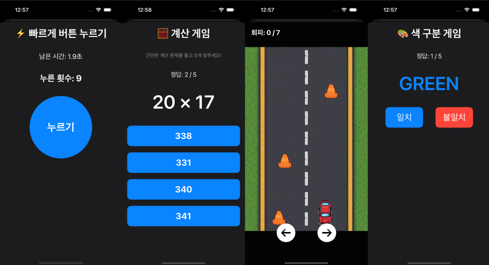
  <p><i>4가지 미니게임 화면 예시</i></p>
</div>

### 게임 상세 설명

#### 1. 빠르게 버튼 누르기 (TapGameView)

<div align="center">
  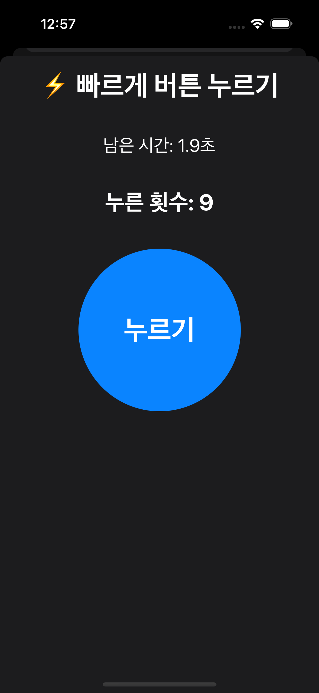
</div>

```swift
// 5초 타이머와 클릭 카운터
@State private var count = 0
@State private var timeLeft: Double = 5.0

// 15번 이상 클릭 시 성공
if count >= 15 { gameFinished = true }
```
- **목표**: 제한 시간 내에 빠르게 클릭하여 반응 속도 향상
- **난이도**: 가장 쉬움 (단순 반복 작업)

#### 2. 자동차 피하기 (CarDodgeGameView)

<div align="center">
  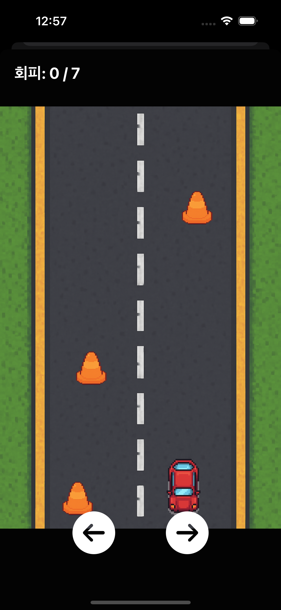
</div>

```swift
// 충돌 감지 로직
let dx = abs(obs.x - carX)
let dy = abs(obs.y - carY)
if dx < 45 && dy < 90 {
    avoidCount = 0  // 실패 시 초기화
}
```
- **목표**: 떨어지는 장애물을 좌우 이동으로 피하기
- **난이도**: 보통 (집중력 필요)
- **특징**: 충돌 시 카운트 초기화로 긴장감 유지

#### 3. 색 구분 게임 (ColorMatchGameView)

<div align="center">
  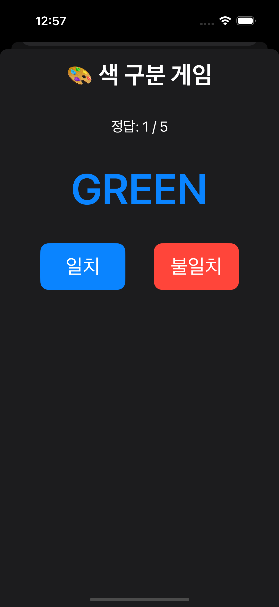
</div>

```swift
// 색상 이름과 실제 색상이 다를 수 있음
currentText = "RED"
currentColor = .blue  // 불일치!
```
- **목표**: 스트룹 효과(Stroop Effect)를 활용한 인지 게임
- **난이도**: 보통 (순간적인 판단력 필요)
- **예시**: "RED"라는 텍스트가 파란색으로 표시 → 불일치 선택

#### 4. 산수 게임 (MathGameView)

<div align="center">
  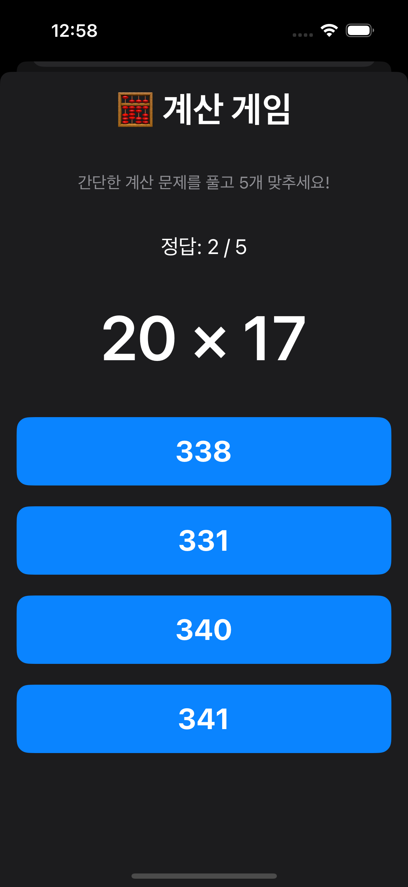
</div>

```swift
// 랜덤 문제 생성
let a = Int.random(in: 1...20)
let b = Int.random(in: 1...20)
let op = ["+", "-", "×"].randomElement()!
```
- **목표**: 간단한 산술 연산으로 뇌 활성화
- **난이도**: 보통 (계산 능력 필요)
- **특징**: 4개 선택지 중 정답 고르기

### 게임 선택 시스템

```swift
@AppStorage("selectedGame") var selectedGame: String = "TapGame"

// GameSelectView에서 게임 선택
// HomeView에서 알람 발동 시 선택된 게임 표시
.sheet(isPresented: $alarmIsRinging) {
    selectedGameView {
        alarmIsRinging = false
        AlarmAudioManager.shared.stopAlarmSound()
    }
}
```

- **UserDefaults 저장**: 선택한 게임이 앱 재시작 후에도 유지됨
- **동적 로딩**: 알람마다 다른 게임 선택 가능

---

## 🔬 핵심 기술 상세

### 1. 합성 데이터 생성 (schedule_img_aug.py)

- **PIL 라이브러리**를 활용한 프로그래매틱 이미지 생성
- **다크/화이트 모드** 랜덤 적용 (50:50 비율)
- **YOLO 포맷** 자동 라벨링
- **다양한 강의 패턴** 랜덤 생성

**클래스 정의:**
- `Class 0`: 강의 블록 (수업 시간대)
- `Class 1`: 시간 라벨 (9시, 10시, ...)

### 2. 객체 인식 모델 (yolo_train.py)

- **YOLOv11n**: 모바일 최적화 경량 모델
- **Transfer Learning**: 사전 학습된 가중치 활용
- **AdamW Optimizer**: 안정적인 학습

### 3. 시간표 분석 알고리즘 (true_inference.py)

```python
def extract_time_schedule(detections, W, H):
    # 1. 요일 가로줄 감지 (cls=1)
    # 2. 강의 블록 감지 (cls=0)
    # 3. X 좌표 → 요일 매핑
    # 4. Y 좌표 → 시간 계산 
    # 5. 요일별 첫 수업 추출 (첫 수업과 요일 맨 윗줄간의 간격)
```

**동작 과정:**
1. YOLOv11 모델이 시간표 이미지에서 객체 감지
2. 감지된 박스를 클래스별로 분류 (강의/시간)
3. 요일 가로줄 박스를 기준으로 시간 영역 계산
4. 각 강의 블록의 X 좌표로 요일 판별
5. Y 좌표로 시간대 계산
6. 요일별 가장 빠른 수업 시간 추출

---

## 💾 데이터베이스 구조

### 사용 기술

- **SQLite**: iOS 기본 내장 데이터베이스
- **GRDB.swift**: Swift용 타입 안전 SQLite ORM
- **UserDefaults**: 앱 설정 저장
- **UserNotifications**: 시스템 알람 관리

### 데이터 모델

#### 1. Timetable (시간표)
```swift
struct Timetable {
    var id: Int64?
    var title: String        // 수업명
    var day: String          // 요일
    var startTime: String    // 시작 시간
    var endTime: String      // 종료 시간
    var defaultAlarm: String // AI 추출 알람
    var userAlarm: String?   // 사용자 설정 알람
}
```

#### 2. DaySchedule (요일별 일정)
```swift
struct DaySchedule {
    var id: Int64?
    var day: String          // 요일
    var classTime: String    // 수업 시간
    var defaultAlarm: String // 기본 알람
    var userAlarm: String?   // 커스텀 알람
}
```

#### 3. Todo (할 일)
```swift
struct Todo {
    var id: Int64?
    var title: String        // 할 일 제목
    var isDone: Bool         // 완료 여부
    var createdAt: Date      // 생성 날짜
}
```

### Repository 패턴

각 데이터 모델마다 전용 Repository 클래스를 통해 CRUD 작업을 수행합니다:

- **TimetableRepository**: 시간표 저장/조회/수정/삭제
- **DayScheduleRepository**: 일별 일정 관리
- **TodoRepository**: 할 일 목록 관리
- **AlarmStore**: 알람 메모리 관리 (Singleton 패턴)

### 데이터 저장 위치

```
~/Documents/
├── schedule.sqlite    # 시간표 및 일정 데이터
└── todos.sqlite       # 할 일 목록 데이터

UserDefaults
├── selectedGame       # 선택된 게임
└── appColorScheme     # 앱 테마 설정
```

### 데이터 흐름

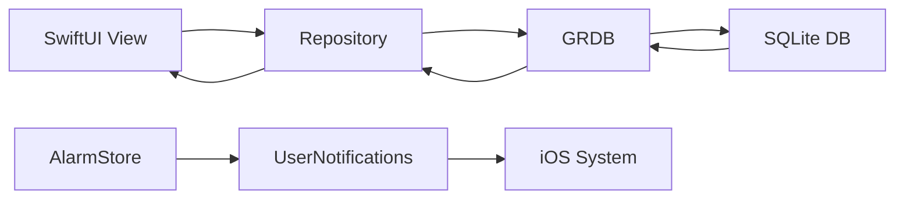

**설명:**
- **Repository 패턴**: SwiftUI View는 Repository를 통해서만 데이터베이스에 접근 (관심사 분리)
- **GRDB ORM**: SQLite와 Swift 간의 타입 안전한 매핑 제공
- **양방향 데이터 흐름**: CRUD 작업 후 최신 데이터를 다시 View로 전달
- **알람 시스템 분리**: AlarmStore는 DB가 아닌 메모리 기반, UserNotifications API로 iOS 시스템 알람 등록

---

## ⚠️ 한계점 및 향후 계획

### 현재 한계점

- ❌ 특정 시간표 포맷(에브리타임)에만 최적화
- ❌ 실제 사용자 데이터 부족 (합성 데이터만 사용)
- ❌ iOS 앱 UI/UX 개선 필요

### 향후 계획

- ✅ **다양한 시간표 포맷** 지원 (학교별 커스터마이징)
- ✅ **실사용자 데이터** 수집 및 재학습
- ✅ **앱 기능 확장**: 알람 커스터마이징, 푸시 알림
- ✅ **Android 버전** 개발
- ✅ **OCR 통합**: 강의명, 강의실 정보 추출
- ✅ **수업별 맞춤 알람**: 수업 전 10분, 30분 등 설정 가능
- ✅ **클라우드 동기화**: 여러 기기 간 데이터 동기화

---

## 🤝 기여

프로젝트에 기여하고 싶으신 분들은 다음 절차를 따라주세요:

1. Fork the Project
2. Create your Feature Branch (`git checkout -b feature/AmazingFeature`)
3. Commit your Changes (`git commit -m 'Add some AmazingFeature'`)
4. Push to the Branch (`git push origin feature/AmazingFeature`)
5. Open a Pull Request

---

## 📄 라이선스

이 프로젝트는 AGPL v3 라이선스 하에 배포됩니다. 자세한 내용은 [LICENSE](LICENSE) 파일을 참조하세요.

---
## 참고
- Ultralytics YOLOv11 Documentation
- Apple CoreML Documentation
- Python Pillow (PIL) Documentation
- SwiftUI Documentation

## 👨‍💻 개발자

- **GitHub**: [@Jaehyeon-kr](https://github.com/Jaehyeon-kr)
- **Email**: qmdlghfl2@gmail.com

---

## 🙏 감사의 말

- [Ultralytics YOLOv11](https://github.com/ultralytics/ultralytics) - 객체 인식 프레임워크
- [Everytime](https://everytime.kr/) - 시간표 포맷 참고

---

<div align="center">

**⭐ 이 프로젝트가 도움이 되셨다면 Star를 눌러주세요!**

Made with ❤️ by Personalize Alarm Team

</div>
